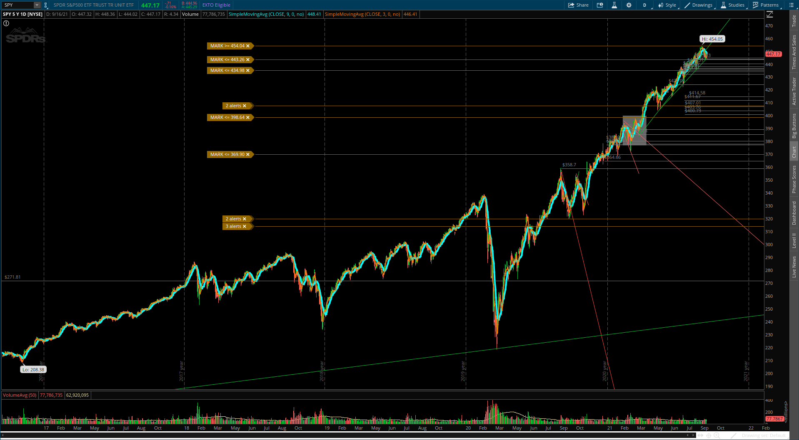
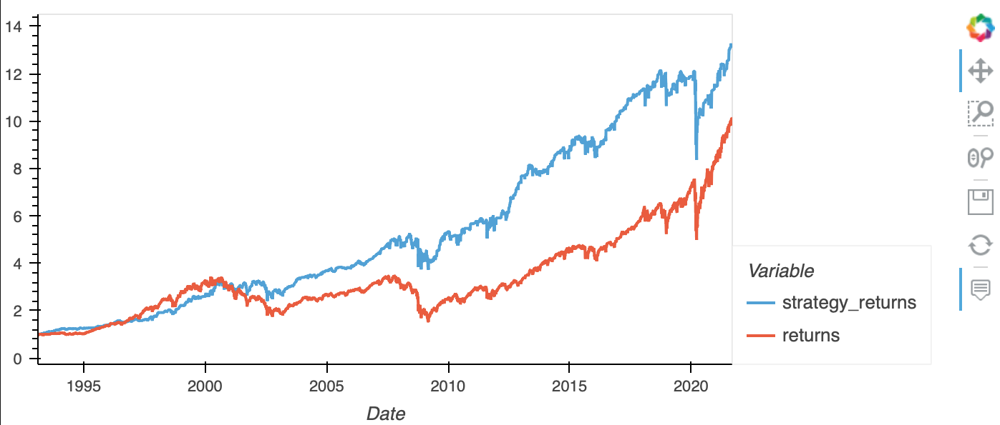
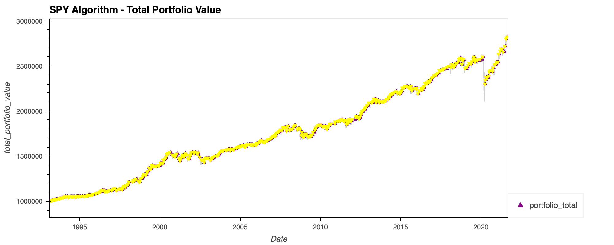
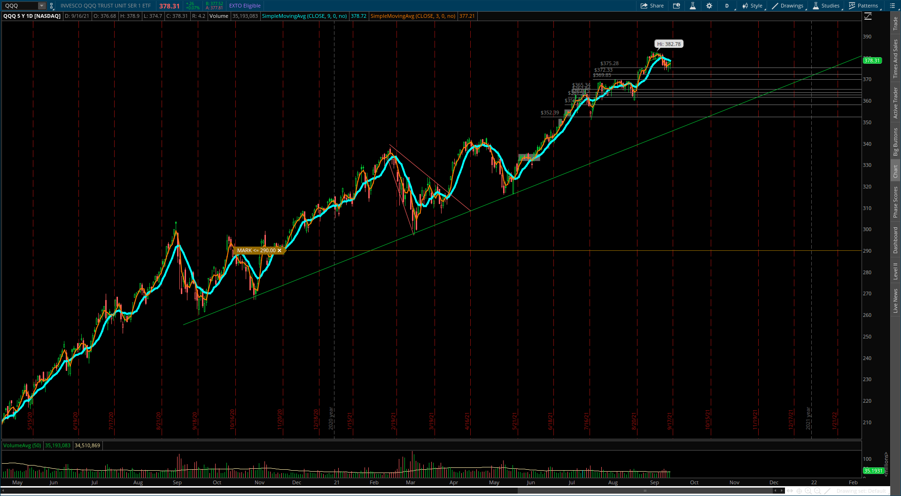
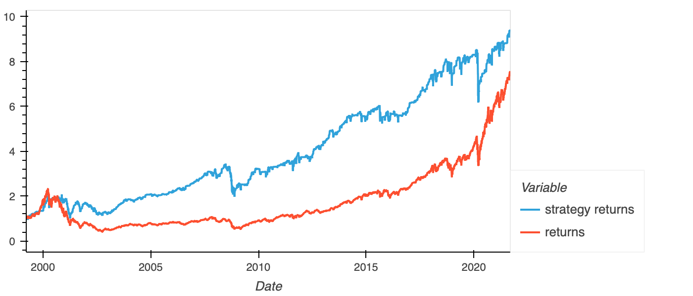
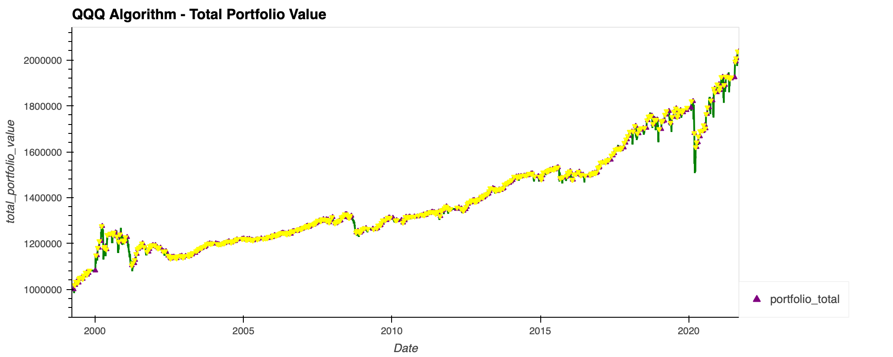

# SwingTradingBot
SwingTradingBot

This project was created using machine learning to develop a swing trading bot. The purpose of our bot is to identify oversold RSI parameters and to initiate buy signals using EMA crossovers. This IS NOT FINANCIAL ADVICE.

## The following steps will be performed in this project
1. Import closing stock data with the ALPACA API Key
2. Setup and generate the trading signals
3. Generating features are target sets
4. Split the data into training and testing datasets
5. Incorporate the SVM machine learning into the trading strategy
6. Backtesting the machine learning trading algorithm
7. Add and train the Logistic Regression machine learning model
8. Backtest the Logistic Regression model using the testing data to evaluate its performance
9. Compare the performance of the logistic regression and SVM models using the classification reports generated with the testing data

## Technology Required
* python version 3.8.5
* Jupyters lab
* FBProphet

## Installation Guide and Running Jupyter Notebook
Installing Jupyter notebook
* On the terminal (Git Bash) under the conda dev environment, type the code below:

pip install jupyterlab

* To open the Jupyter notebook
Open a new Git Bash and type the below command into your conda dev environment:

jupyter lab

* then hit the ENTER key to run

## Running FBProphet
* On your web browser, copy and paste this link below

https://colab.research.google.com/notebooks/intro.ipynb?utm_source=scs-index#recent=true

* upload your ipynb file

## Installing Scikit-learn
* Activate your development environment then run the following command:

pip install -U scikit-learn

## Imports Required
* !pip install alpaca-trade-api
* import os
* import requests
* import pandas as pd
* import hvplot.pandas
* import numpy as np
* from dotenv import load_dotenv
* import alpaca_trade_api as tradeapi
* from pandas.tseries.offsets import DateOffset
* from sklearn.preprocessing import StandardScaler
* from sklearn import svm
* from sklearn.metrics import classification_report
* from sklearn.linear_model import LogisticRegression

## Usage
To use the notebook:
1. Clone the repo
2. Run jupter lab git bash
3. Open file SwingTradeAlgo.pynb

### Contributors
Neha Jantre, Martique Henton, Cole Ferral, Zach Zwiener

### Contact
Email - zachzwiener3@gmail.com
Email - martique.henton@gmail.com
Email - nehaj910@gmail.com
Email - coleferrell123@yahoo.com

### License
MIT